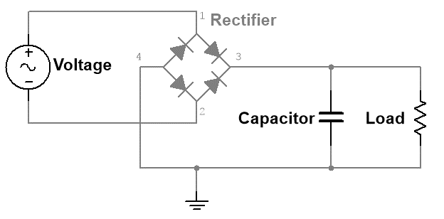
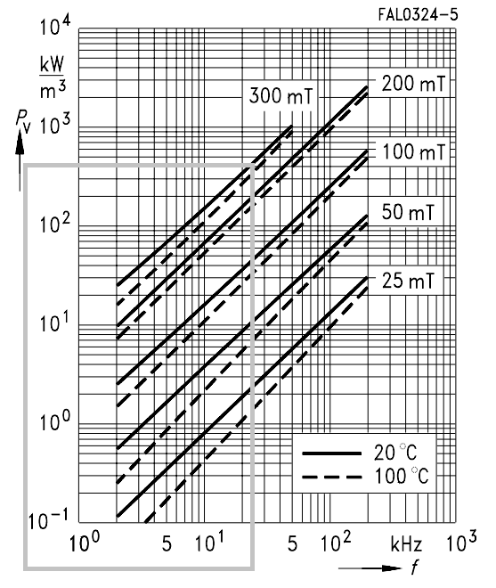
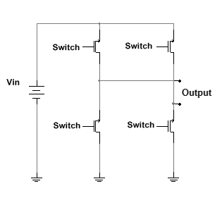
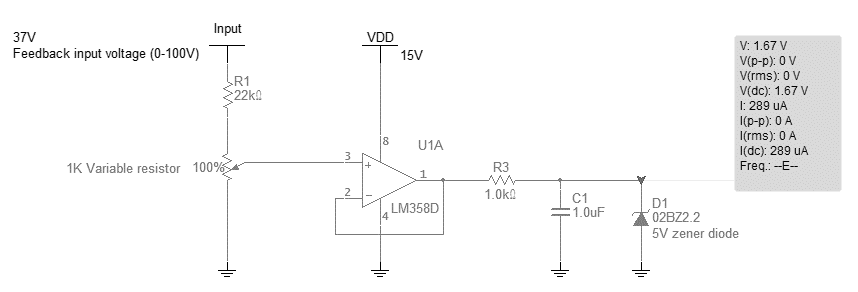
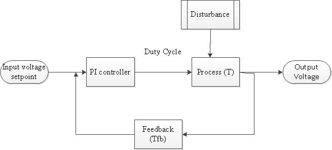
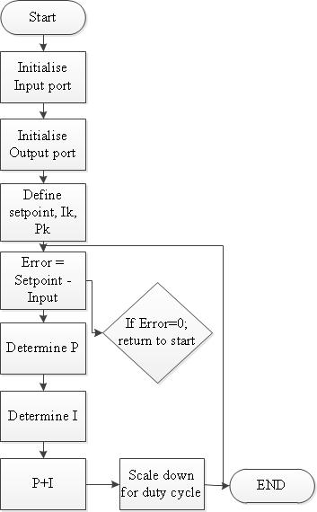
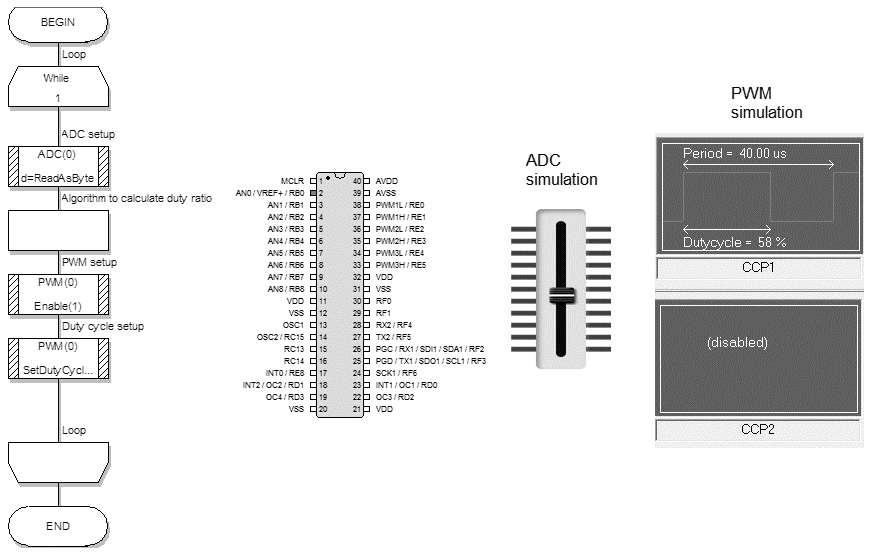
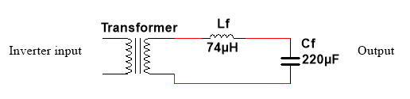
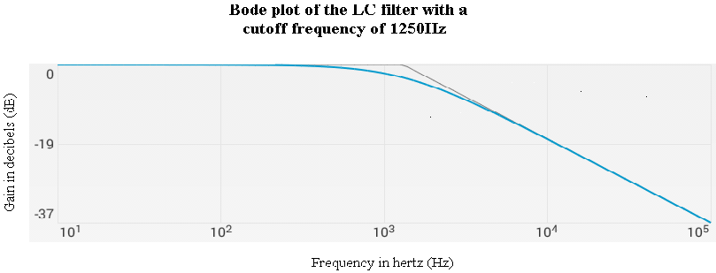

# ---
math: true
---
# DESIGN AND IMPLEMENTATION

## APPROACH

The main approach used to meet the objectives of this project was the
systems engineering approach. This section is divided into sub-sections.

### Input filter

The first step to the solution is to rectify the input voltage and
current from the mains supply. This will require a full bridge rectifier
with an output capacitor. Full bridge rectifiers can easily be purchased
off the shelf, but for this project it will be designed from first
principles. Diodes that provide the least voltage drop when conducting
will be used to minimize power loss in this stage of the overall system.
The input filter is also the first step to prevent EMI from the main's
supply input voltage and current.

### DC-DC converter topology

There are several ways to reach the desired voltage output, one way is
to step up the voltage to 230V DC and then invert it. This approach
however will need components that can handle higher voltages and
currents. The control of these power electronic circuits could prove to
be troublesome because of the high voltages. The other approach is to
step down the input voltage to 17V DC and then invert it into AC, this
then is fed into a transformer (20:1 step up transformer to create the
final 230Vac output). This approach is more practical and safer to build
because of the lower voltages but adds bulk to the overall system. The
transformer also increases the harmonics. The approach with the lower
voltages was chosen.

Approach using a step up converter

Approach using a buck converter with a transformer

According to the literature study, there are numerous step down DC-DC
converters, the final choice was either between the conventional buck
converter and the flyback converter. The buck converter was chosen since
it can meet up with the power requirements and simplifies the design
process since an inductor is needed rather than a flyback transformer.

The choice of the switching frequency is important, Most of the losses
in a SMPS system are contributed by the switching losses, this means the
switching frequency chosen should be fast to minimize losses and at the
same time not be too fast to produce unnecessary EMI (normally between
70kHz and 300kHz) according to \[11\]. The switching frequency is also
based on the inductor material that is used.

According to the literature study, the power MOSFET is better for high
frequency and low power application so therefore it was chosen as
opposed to the IGBT. The MOSFET switch for the buck converter will be
chosen based on the maximum stress voltage maximum peak input current,
total power losses, maximum allowed operating temperature, and current
driver capability of the driver. Besides maximum voltage rating, and
maximum current rating, the others three important parameters of a
MOSFET are Rds[^1](on), gate threshold voltage, and gate capacitance.

The buck converter will be modelled by differential equations and will
initially be designed as an ideal circuit. From this model, non-ideal
components will be added and the final state space and laplace
transforms will determined to design the control circuit. The ideal
state space equations will be used to size the switches and inductor
with a 20% tolerance.

The buck converter's inductor itself will be designed with the selected
switching frequency being the core of the design process. The most
important aspect of a buck converter is the inductor which can also be
considered. The design of the inductor has to take into account various
other factors such as:

- Operating temperatures

- Flux density

- Core saturation

- Magnetising flux

- Leakage flux

- Winding loss and currents

Based on these factors the core will be selected with the final
windings.

The final buck converter circuit has to be able to handle the heat
dissipation and spikes of the switches which means a thermal design and
snubber circuits are needed.

## Inverter

Part of the requirements was to have a smooth sine wave output so the
only choice was between the half bridge and full bridge converter. Full
bridge converter was chosen since its switches require half the ratings
compared to a half bridge inverter and the output of the buck converter
needs only to be 17V (as opposed to 34V if it was a half bridge
converter).

The next important criteria is to select $M_{a\ }$and $M_{f}$ and the
switching scheme. Theoretically the value of $M_{a\ }$will be selected
within the range of 0.8-0.9 and the $M_{f}$ will be set to a value that
will minimize harmonics. Based on the literature study for the switching
schemes, the digital switching scheme was chosen since it is less
cumbersome to implement as opposed to the more analog based (unipolar
and bipolar) schemes. This also means that $M_{a\ }$and $M_{f}$ can be
ignored.

The full bridge inverter will be modelled by differential equations and
will initially be designed as an ideal circuit. From this model,
non-ideal components will be added and the final state space and laplace
transforms will determined to design the control circuit.

For similar reasons with the selection of the switch type in the buck
converter, the power MOSFET will once again be selected as opposed to
the IGBT. The MOSFET switch for the full bridge inverter will be chosen
based on the maximum stress voltage maximum peak input current and total
power loss.

Final full bridge inverter circuit has to be able to handle the heat
dissipation and spikes of the switches which means a thermal design and
snubber circuits are needed.

## DETAILED DESIGN AND IMPLEMENTATION

### Overall design 

The wind synchronization project is comprised of sub-systems and each
one has its own specifications and requirements. Shown below is a flow
diagram of the overall system and a network diagram of subsystems that
make up the project:

{alt="C:\\Users\\PVT\\Desktop\\SMPS Converter (2).png"
width="6.133333333333334in" height="4.941571522309712in"}

Network diagram of proposed system

The project consists of two main systems and two systems. The two main
systems are the AC-DC converter and the DC-AC inverter. The two
subsystems are the power supply and the output filter. The power supply
is responsible for powering the microcontrollers and gate drivers. The
output filter ensures that the output of the inverter will be a smooth
sinusoidal signal. This section will first cover the two main systems
and then the subsystems will be discussed.

### Input Filter design

Since the input to the system is an AC signal (20-60Vac, 0-300Hz), the
first step is to rectify it with a full bridge rectifier[^2] and a
capacitor. The selection and sizing of the capacitor will determine the
voltage ripple of the output. Shown below is the circuit schematic of
the input stage of the system:

12.](media/image4.png){alt="C:\\Users\\PVT\\Desktop\\Wind integration\\Simulations\\Full.png"
width="3.1927766841644796in" height="1.5748698600174977in"}

Circuit diagram of the input stage of the system

The following equation was used to determine the capacitor size,

  -----------------------------------------------------------------------------------------------
  $$
  C_{filter} = \frac{0.045 P_{load}}{\eta (V_{in, min, pk})^2}
  $$
  *(1)*
  -----------------------------------------------------------------------------------------------

Where $C_{filter}\$is the value of the input capacitor (Farads, F);
$P_{load}$ is the load of the circuit (Watts, W); $\eta$ is the
efficiency of the converter and is assumed to be 60% and
$V_{in,\ min.\ pk}$ is the minimum input voltage (Volts, V). The
respective values were substituted in equation [*(1)*](#_Ref402389989).

  ---------------------------------------------------------------------------------------------
  $$C_{in} = \frac{0,045 \times 100}{0.6 \times {(\sqrt{2} \times 20)}^{2}} = 120uF$$   *(2)*
  ------------------------------------------------------------------------------------- -------

  ---------------------------------------------------------------------------------------------

A safety factor of 2 was used to rate the voltage tolerance of the input
capacitor. The maximum is assumed to be 100Vdc which translates to a
200Vdc capacitor with a value of 120uF.

### Buck Converter design

The input voltage range is between 20 -- 60 Vac (processed into a DC
voltage by the input filter, [3.1.1](#input-filter)), which translates
to approximately 25-85Vdc. A buck converter will be used to step down
the voltage to 17V. The ideal circuit schematic of the buck converter is
shown below:

![[]{#_Ref397276600 .anchor}Figure
13.](media/image5.png){alt="C:\\Users\\PVT\\Desktop\\Wind integration\\Simulations\\buck.png"
width="4.653587051618548in" height="1.7391294838145233in"}

Circuit diagram of an ideal buck converter.

The important circuit parameters of the circuit are the inductor and
capacitor. These two components determine the output current and
voltage. There are two distinct operation modes for this converter, one
is when the "switch" is "on" and the second is when the "switch" is
"off". Shown below is effectively how the circuit behaves when the
"switch" is "on":

{alt="C:\\Users\\PVT\\Desktop\\Wind integration\\Simulations\\on time.png"
width="5.097280183727034in" height="1.8411537620297462in"}

How the buck converter circuit effectively behaves like when the
\"Switch\" is \"on\".

While the "switch" is conducting, the diode in [Figure
13](#_Ref397276600) is bypassed. When a KVL loop is applied to the above
circuit, one gets the following governing equation:

  -------------------------------------------------------------------------
  $$V_{dc} = V_{ce} + i_{L}.R_{L} + V_{out} + V_{L}$$               *(3)*
  ----------------------------------------------------------------- -------

  -------------------------------------------------------------------------

Where $V_{dc}$ is the input voltage (Volts, V); $V_{ce}$ is the voltage
of the "switch" when conducting (Volts, V); $i_{L}$ is the current of
the inductor (Amperes, A); $R_{L}$ is the effective resistance of the
inductor and is measured (Ohms, Ω) and is assumed to be negligible;
$V_{out}$ is the output voltage with respect to the load (Volts, V) and
$V_{L}$ is the voltage of the inductor (Volts, V).

When a KCL loop is applied, one gets the following governing equations:

  -------------------------------------------------------------------------
  $$i_{L} = i_{c} + i_{out}$$                                       *(4)*
  ----------------------------------------------------------------- -------
  $$i_{L} = i_{sw}$$                                                *(5)*

  -------------------------------------------------------------------------

Where $i_{c}$ is the current of the capacitor (Amperes, A); $i_{out}$ is
the output current as measured from the load (Amperes, A) and $i_{sw}$
is the current of the "switch" (Amperes, A).

When the "switch" is "off", the current dynamics of the system changes.
Shown below is effectively how the circuit behaves when the "switch" is
"off":

{alt="C:\\Users\\PVT\\Desktop\\Wind integration\\Simulations\\off time.png"
width="3.6666666666666665in" height="1.6888888888888889in"}

How the buck converter circuit effectively behaves like when the
\"Switch\" is \"off\".

During this phase, the input voltage and "switch" can be ignored since
the power now is being transferred from the inductor and capacitor into
the load. When a KVL loop is applied to the above circuit, one gets the
following governing equation:

  -------------------------------------------------------------------------
  $$V_{FWD} = i_{L}.R_{L} + V_{out} + V_{L}$$                       *(6)*
  ----------------------------------------------------------------- -------

  -------------------------------------------------------------------------

Where $V_{FWD}$ is the voltage of the diode when it is forward biased
(Volts, V) and is approximately 1,2V according to the specific diode
used[^3].

When a KCL loop is applied, one gets the following governing equations:

  -------------------------------------------------------------------------
  $$i_{L} = i_{D}$$                                                 *(7)*
  ----------------------------------------------------------------- -------

  -------------------------------------------------------------------------

Where $i_{D}$ is the current of the "free wheeling" diode (Amperes, A).

The voltage across the inductor is zero over one cycle. During "Ton":
$i_{L}.R_{L} = V_{DC} + V_{CE} - V_{out} = V_{L}$ and during "Ton":
$i_{L}.R_{L} = V_{FWD} - V_{out}$. Substituting the equations with each
other yields the following equation:

  ----------------------------------------------------------------------------------------
  $$\delta = \frac{V_{FWD} + i_{L}.R_{L} + V_{out}}{V_{dc} + V_{FWD} - V_{CE}}$$   *(8)*
  -------------------------------------------------------------------------------- -------

  ----------------------------------------------------------------------------------------

Where $\delta$ is the duty ratio.

Based on the above duty ratio equation, the duty ration range was
determined with a 10% tolerance for an input voltage range of 20-90Vdc.
$V_{CE}\$is assumed to be 1,5V when it is turned on.

  ----------------------------------------------------------------------------------------
  $$\delta_{\max} = \frac{1,2 + (5,88 \times 0) + 17}{20 + 1,2 - 1,5} = 0,925$$   *(9)*
  ------------------------------------------------------------------------------- --------
  $$\delta_{\min} = \frac{1,2 + (5,88 \times 0) + 17}{90 + 1,2 - 1,5} = 0,205$$   *(10)*

  ----------------------------------------------------------------------------------------

Therefore the duty ratio range is 0,205 - 0,925.

Current through an inductor ($L$) can be used to find the voltage across
an inductor ($V_{L}$), with the use of the following fundamental
equation:

  --------------------------------------------------------------------------
  $$V_{L} = L.\frac{di}{dt}$$                                       *(11)*
  ----------------------------------------------------------------- --------
                                                                    

  $$\therefore\frac{di}{dt} = \frac{V_{L}}{L}$$                     *(12)*
  --------------------------------------------------------------------------

Over one switching cycle, the average voltage of the inductor has to be
zero to avoid the saturation of the inductor.

  -----------------------------------------------------------------------------------------------------------------------------
  $${\Delta i}_{L,pk - pk} = \frac{\left( V_{DC} - V_{CE} - i_{L}.R_{L} - V_{out} \right).\delta.T_{SW}}{L}$$          *(13)*
  -------------------------------------------------------------------------------------------------------------------- --------
  $$L_{\min} = \frac{\left( V_{DC} - V_{CE} - i_{L}.R_{L} - V_{out} \right).\delta.T_{SW}}{{\Delta i}_{L,pk - pk}}$$   *(14)*

  -----------------------------------------------------------------------------------------------------------------------------

Where $\frac{di}{dt}$ is the change in current of the inductor (Amperes
per second, $A.s^{- 1}$); $V_{L}$ is the voltage of the inductor (Volts,
V); $L$ is the inductance of the inductor (Henry, H) is and
${\Delta i}_{L,pk - pk}$ is the peak to peak current of the inductor
(Amperes, A).

To determine ${\Delta i}_{L,pk - pk}$, the output current of the buck
converter needs to be known and can be found out by using the following
formulae.

  --------------------------------------------------------------------------
  $$P_{out} = V_{out}.I_{out}$$                                     *(15)*
  ----------------------------------------------------------------- --------
  $$I_{L,ave} = I_{out}$$                                           *(16)*

  --------------------------------------------------------------------------

Where $P_{out}\$is the output power of the buck converter which is
selected to be 100W; $V_{out}$ is the output voltage which is 17Vdc;
$I_{L,ave}$ and $I_{out}\$are the average inductor current and the
output current respectively (Amperes, A).

Based on the above formulas, the $I_{L,ave}$ was calculated to be 5,88A

Therefore the minimum inductance needed is found with the assumption
that the peak to peak inductor current is 25%:

  ------------------------------------------------------------------------------------------------------------------------------------------------
  $$L_{\min} = \frac{\left( 90 - 1,5 - (5,88 \times 0) - 17 \right) \times 0,205}{(0,25 \times 5,88) \times 25000} = 830uH$$   []{#_Ref402694419
                                                                                                                               .anchor}*(17)*
  ---------------------------------------------------------------------------------------------------------------------------- -------------------

  ------------------------------------------------------------------------------------------------------------------------------------------------

During switching the current through the inductor is split in half:

$0 < t <$ $\delta.T_{SW}$ is the switch current ($i_{SW}$).

$\delta.T_{SW} < t <$ $T_{SW}$ is the diode current ($i_{D}$).

  ------------------------------------------------------------------------------------------------------------------------------------
  $$I_{L,RMS} = I_{L,avg}\sqrt{1 + \frac{1}{\delta}\left( \frac{\frac{{\Delta i}_{L,pk - pk}}{2}}{I_{L,avg}} \right)^{2}}$$   *(18)*
  --------------------------------------------------------------------------------------------------------------------------- --------

  ------------------------------------------------------------------------------------------------------------------------------------

Therefore the RMS current of the inductor is:

  ---------------------------------------------------------------------------------------------------------------------------
  $$I_{L,RMS} = 5,88\sqrt{1 + \frac{1}{0,205}\left( \frac{\frac{0,1 \times 5,88}{2}}{5,88} \right)^{2}} = 5,916A$$   *(19)*
  ------------------------------------------------------------------------------------------------------------------ --------

  ---------------------------------------------------------------------------------------------------------------------------

By removing the DC offset of the inductor current, one can get the
capacitor current since the capacitor current processes the ripple
content of the current. The ripple voltage is set to be 10%.

#### Output capacitor

The selection of the output capacitor depends on the type of converter,
ripple tolerance and operating frequency. A well-chosen capacitor will
produce a smooth output with negligible losses. The performance of a
capacitor in terms of the ripple is based on the ESR of the capacitor.
The ESR has a direct influence on the output ripple and since it is acts
as a passive dissipative element, it generates heat which reduces the
life span of a capacitor.

To find out the value of the capacitor needed, one has to have a look at
the current waveform of the capacitor. The current oscillates around the
zero point with a peak value of half the ripple. If one integrates the
area of one time period of this waveform, the $C_{out}$ value can be
calculated.

  -----------------------------------------------------------------------------
       $$V_{out} = \frac{1}{C_{out}}\int_{t_{1}}^{t_{2}}{\ i}.dt$$   *(20**)*
  ---- ------------------------------------------------------------- ----------

  -----------------------------------------------------------------------------

The average current between the interval of $t_{2}$ and $t_{1}$ is
$\frac{{\mathrm{\Delta}I}_{out}}{4}$. Based on this value, when one
integrates the above integral the following equation will yield the
following:

    ----------------------------------------------------------------------------------------------------------------
    $$
    V_{out} = \frac{I_{out} T}{4 C_{out}} = \frac{(\Delta I_{out}) T}{8 C_{out}}
    $$
    *(21)*
    ----------------------------------------------------------------------------------------------------------------

Where T is the time interval between $t_{2}$ and $t_{1}$. Rearranging
the above expression to make the output capacitor the subject of the
formula.

    -------------------------------------------------------------------------------------------
    $$
    C_{out} = \frac{\Delta I_{out}}{8 f \Delta V_{out}}
    $$
    *(22)*
    -------------------------------------------------------------------------------------------

Where $f\$is the operating frequency ($\frac{1}{T}$) (Selected to be
25kHz). It was specified that the output ripple of both the voltage and
current should be 10%. A safety margin will be used to ensure even
better performance by assigning a 0.05% voltage ripple for the output
voltage and a 10% ripple for the current, this will ensure a larger
capacitor value and therefore a smoother output.

    ---------------------------------------------------------------------------
    $$
    C_{out} = \frac{0.1 I_{out}}{8 f (0.005 V_{out})}
    $$
    *(23)*
    ---------------------------------------------------------------------------

Once the values get substituted in the above equation;

  -----------------------------------------------------------------------------------------------------------
  $$
  C_{out} = \frac{0.1 \times 5.88}{8 \times 25 \times 10^{3} \times (0.005 \times 17)} = 345uF
  $$
  *(24)*
  -----------------------------------------------------------------------------------------------------------

As mentioned earlier that the ESR of a capacitor determines the ripple,
therefore the maximum ESR value to produce the above voltage and current
ripple is;

  -----------------------------------------------------------------------------------------------------------------------
  $${ESR}_{\max} = \frac{{\mathrm{\Delta}V}_{out}}{{\mathrm{\Delta}I}_{out}} = \frac{0,095}{1} = 0,095\Omega$$   *(25)*
  -------------------------------------------------------------------------------------------------------------- --------

  -----------------------------------------------------------------------------------------------------------------------

If the above ESR value cannot be obtained from one capacitors then a
possible solution is to connect the capacitors in parallel, since the
ESR acts just like normal resistors when connected in parallel.

Shown below are simulation results for the ideal buck converter with a
90V and 20V DC input:

{alt="C:\\Users\\PVT\\Desktop\\20v buck circuit ideal.png"
width="5.458333333333333in" height="2.619089020122485in"}

Ideal buck converter circuit with 90V input with a duty ratio of 0.85.

![[]{#_Ref400813774 .anchor}Figure
17.](media/image9.png){alt="G:\\Pictures\\20v buck circuit ideal transient.png"
width="3.637896981627297in" height="3.3333333333333335in"}

Output voltage of buck converter with 20V input and duty ratio of 0.85.

{alt="C:\\Users\\PVT\\Desktop\\90v buck circuit ideal.png"
width="5.508333333333334in" height="2.4558956692913387in"}

Ideal buck converter circuit with 90V input with a duty ration of 0.18

![[]{#_Ref400814968 .anchor}Figure
19.](media/image11.png){alt="G:\\Pictures\\90v buck circuit ideal transient.png"
width="3.490025153105862in" height="3.175in"}

Output voltage and current of buck converter with 90V input with a duty
ratio of 0.18.

Comparing the above simulation ([Figure 17](#_Ref400813774) and [Figure
19](#_Ref400814968)) results shows that the output voltage and current
are identical. The only difference with the simulated circuit is the
duty ratios.

#### Inductor

The design of the inductor is determined by the following design inputs;
the peak, average and RMS current the inductor has to process, the
switching frequency, ambient and inductor surface temperatures and the
inductance \[12\].

Analyzing the waveform of the inductor current determines if the
inductor needed is needed for a DC or AC application. If the polarity is
never negative then a DC inductor is needed and operates in one
quadrant. Hence the frequency of the inductor is not an issue since the
hysteresis is negligible. There are various materials that can be used
to make up the core of this inductor like METGLAS, steel or ferrites.

Ferrite was chosen since it suited the particular application based on
frequency. The only available core type available was the N27 ferrite
with a maximum $B_{c}$ of 350mT according to the B-H curve in the
datasheet. One should choose a $B_{c}$ near the curve of the "knee". The
ripple percentage of the $B_{c}$ should be the same as the
${\Delta i}_{L,pk - pk}$ to avoid saturation.

  ---------------------------------------------------------------------------------------------------
  $$J_{RMS} = \sqrt{\frac{P_{c,sp}}{k_{cu}.p_{cu}.\left( \frac{R_{AC}}{R_{DC}} \right)}}$$   *(26)*
  ------------------------------------------------------------------------------------------ --------

  ---------------------------------------------------------------------------------------------------

Where $J_{RMS}$ is the current density of the inductor winding (Amperes
per area squared, $\frac{A}{{mm}^{2}}$); $P_{c,sp}$ is the power
capacity as according to the core material's datasheet (Watts per
volume, $\frac{kW}{m^{3}}$); $p_{cu}$ is the conductivity of copper
which is $2.2 \times 10^{- 8}$Ʊ; $\frac{R_{AC}}{R_{DC}}$ is the ratio of
the AC and DC resistance of the wire, which is a 1 for a DC system;
$k_{cu}$ is the copper fill factor which is assumed to be 0.45 in a DC
system since stranded wire is not needed.

{alt="C:\\Users\\PVT\\Desktop\\n27.png"
width="2.783333333333333in" height="3.2980238407699036in"}

Relative core loss versus frequency with a selected frequency of 25kHz
at 300mT

Based on the above graph[^4], the frequency was selected for 25kHz with
a flux density of 300mT.

Therefore;

  -------------------------------------------------------------------------------------------------------------------
  $$J_{RMS} = \sqrt{\frac{370}{0,45 \times 2.2 \times 10^{- 8} \times 1}} = 5,9 \times 10^{6\ }A.m^{- 2}$$   *(27)*
  ---------------------------------------------------------------------------------------------------------- --------

  -------------------------------------------------------------------------------------------------------------------

The window product is shown below:

  -----------------------------------------------------------------------------------------
  $$A_{w}.A_{c} = A_{p} = \frac{L.I_{L,pk}.I_{L,RMS}}{k_{cu}.B_{core}.J_{RMS}}$$   *(28)*
  -------------------------------------------------------------------------------- --------

  -----------------------------------------------------------------------------------------

Where $L$ is the inductance of the inductor calculated previously with
equation [*(17)*](#_Ref402694419) for the buck converter (H, henry);
$I_{L,pk}$ and $I_{L,RMS}$ are the peak and RMS currents of the inductor
as calculated previously (A, Amperes); $B_{core}$ is the flux density of
the core and is selected to be 300mT (T, Teslas); $k_{cu}$ is the copper
fill factor and is assumed to be 0,45 and $J_{RMS}$ is the current
density.

Therefore;

  ---------------------------------------------------------------------------------------------------------------------------------
  $$A_{w}.A_{c} = A_{p} = \frac{830 \times 7,35 \times 5,91}{0,45 \times 300 \times 5,9 \times 10^{6\ }} = 2,6{cm}^{4}$$   *(29)*
  ------------------------------------------------------------------------------------------------------------------------ --------

  ---------------------------------------------------------------------------------------------------------------------------------

$A_{p}\$is given in ${cm}^{4}$ and the dimensions of $A_{w}$ and $A_{c}$
are $a,\ b,d\$and $h$. Depending on the core shape, there are different
ratios of $a,\ b,d\$and $h$ with respect to $a$. The available core
sizes were "E" shaped. The particular "E" shaped core was the E55/28/21.
The dimensions of the core are based on the datasheet core shape's
datasheet[^5]. Shown below is the core dimensions.

{alt="C:\\Users\\PVT\\Desktop\\e core dimensions.png"
width="2.5646872265966754in" height="2.3583333333333334in"}

E core dimensions based on the datasheet

  ---------------------------------------------------------------------------------------
  $$A_{p} = A_{w}.A_{c} = \lbrack b \times h\rbrack\lbrack a \times d\rbrack$$   *(30)*
  ------------------------------------------------------------------------------ --------

  ---------------------------------------------------------------------------------------

The above equation is needed to solve for "$a$".

To calculate the conductor's cross sectional area in
$\frac{A}{{mm}^{2}}$ ($A_{cu}$);

  --------------------------------------------------------------------------
  $$A_{cu} = \frac{I_{RMS}}{J_{RMS}}$$                              *(31)*
  ----------------------------------------------------------------- --------

  --------------------------------------------------------------------------

Therefore;

  ---------------------------------------------------------------------------
       $$A_{cu} = \frac{5,91}{5,9} = 1\frac{A}{{mm}^{2}}$$           *(32)*
  ---- ------------------------------------------------------------- --------

  ---------------------------------------------------------------------------

Therefore the diameter of the wire in $mm$ is ($d_{wire}$);

  ---------------------------------------------------------------------------
       $$d_{wire} = \sqrt{\frac{{4.A}_{cu}}{\pi}}$$                    *(33)*
  ---- ------------------------------------------------------------- --------
       $$d_{wire} = \sqrt{\frac{4 \times 1}{\pi}} = 1,127mm$$          *(34)*

  ---------------------------------------------------------------------------

To find out the number of turns ($N$);

+-----------------------------------------------------------------+--------+
| $$N = \frac{A_{w}{.k}_{cu}}{A_{cu}}$$                           | *(35)* |
|                                                                 |        |
| Therefore                                                       |        |
+=================================================================+========+

  --------------------------------------------------------------------------
  $$N = \frac{186.7 \times 0.45}{1} = 84\ turns$$                   *(36)*
  ----------------------------------------------------------------- --------

  --------------------------------------------------------------------------

### full bridge Inverter design

For the inverter, it was decided that a full bridge topology would be
used to limit voltage and current stresses on the switches. Shown below
is a circuit diagram of a full bridge inverter:

{alt="G:\\Pictures\\inverter simple.png"
width="3.175in" height="2.8274453193350833in"}

Full bridge inverter diagram

The main part of the inverter is the software needed to change the PWM
signals which will discussed later on in this report. The sizing of the
switches is primarily based on the currents and voltages that each
switch will experience. The ratings of the switches was oversized to
take into account stray inductances of the circuit which could
potentially cause high voltage spikes. The switches should also be fast
acting in terms of switching. The ideal input voltage of the full bridge
inverter is 17Vdc.

### Control

This section will deal with the control of the buck converter and full
bridge inverter. The first part will be for the buck converter.

#### Buck converter control

The microcontroller used for the buck converter is the dsPIC30F4011.
This particular dsPIC has six dedicated PWM channels. The input voltage
of the system gets measured and processed by the dsPIC with the
microcontroller's inbuilt ADC module. Based on the ADC value measured,
the corresponding duty ratio will be sent to the PWM output pin.

##### ADC  {#adc .Heading5}

The input DC voltage for the buck converter can range from 30-85Vdc,
this range will be extended to 0-100Vdc. The dsPIC30F4011 can accept 5V
inputs which means the input voltage needs to be scaled down to 5V. To
achieve this, a voltage divider is needed and to protect the ADC pin
from sinking too much current a voltage follower circuit is connected to
the output of the voltage divider. Shown below is the ADC circuit;

{alt="G:\\Pictures\\adc.png"
width="6.0in" height="2.0437193788276464in"}

An ADC circuit with a 37V input and an output voltage of 1.67V.

Shown above is the ADC circuit used with a voltage divider using a 22kΩ
(5 watt resistor) and a 1kΩ potentiometer. The output of the voltage
regulator is the input of the operational amplifier (LM358) which is
powered by a 15V source. Connections to the operational amplifier are
wired according to the manufacturer's datasheet[^6]. The output of the
operational amplifier is at pin 1 and is connected to a 1kΩ resistor to
limit the current. The final stage is to connect a 1uF capacitor and a
zener diode. Voltage stabilization is achieved with the capacitor and
the zener diode (5V zener diode) offers over voltage protection for the
microcontroller. The next sub section will deal with the controller for
the buck converter.

##### Feedback control {#feedback-control .Heading5}

Small signal analysis was used on a simplified buck converter system
that ignores ESR of the output capacitor, the resistance of the
inductor, snubber circuits and input filter. Shown below is the buck
converter that was used to derive the equations;

{alt="C:\\Users\\PVT\\Desktop\\Wind integration\\Simulations\\buck.png"
width="4.653587051618548in" height="1.7391294838145233in"}

Buck converter diagram for small signal analysis

From the above diagram, the following AC perturbations were added along
with the governing differential equations:

$$v_{Out} = V_{o} + \widetilde{v_{o}}$$

$$D = d + \widetilde{d}$$

Substituting the above perturbed variables into the differential
equations yields the following Laplace transfer function ($T$) with zero
initial conditions that compares the duty cycle to the output voltage.

  ------------------------------------------------------------------------------------------------------------------------------------------------------------------------------------------
       $$T = \frac{\widetilde{v_{out}}}{\widetilde{d}} = \frac{\frac{V_{in}}{LC}}{s^{2} + s\left\lbrack \frac{1}{C.R} \right\rbrack + \left\lbrack \frac{1}{L.C} \right\rbrack}$$   *(37)*
  ---- ---------------------------------------------------------------------------------------------------------------------------------------------------------------------------- --------

  ------------------------------------------------------------------------------------------------------------------------------------------------------------------------------------------

Where $V_{out}$ output voltage; $V_{in}$ is the input voltage; $I_{L}$
the steady state inductor current; $d$ the steady state duty ratio; $R$
is the load resistance; C the output capacitor; L the inductance of the
inductor

Substituting variables that will produce the maximum power transfer into
the above equation:

$$T = \frac{\widetilde{v_{o}}}{\widetilde{d}} = \frac{- 1,581 \times 10^{4}s + 5,634 \times 10^{8}}{s^{2} + 5,161 \times 10^{4}s + 5,176 \times 10^{5}}$$

PID control will not be used since the D term is not needed based on the
following reasons:

- Any noise in the system will drive the system into instability since
  the "D" term is sensitive to erratic signal changes and noise.

- The "D" term is usually required only for slow changing processes.

- The "P" and "I" terms are sufficient for the control of the output
  voltage since all that is required is to eliminate the offset and
  steady state error.

Since the output voltage feedback block ${(T}_{FB})$ has been
determined, it can be incorporated in the control system diagram with
the transfer function "$T"$ to give the figure below.

{alt="E:\\Drawing1.jpg"
width="4.7253291776027995in" height="2.1354166666666665in"}

Control system flow diagram

The PI controller will be done programmed in software. Shown below is a
equation of the PI controller:

  ---------------------------------------------------------------------------
       $$C(t) = k_{p}.e(t) + k_{i}.\int_{}^{}{e(t).dt}$$             *(38)*
  ---- ------------------------------------------------------------- --------

  ---------------------------------------------------------------------------

Where $C(t)$ and $e(t)$ are the "PI controller" and "error" function.
$k_{p}$ and $k_{i}$ are the "proportional" and "integral" constants
(values between 0.00001 and 10).

Shown below is the flow diagram of the code that will generate the
correct duty cycle for the MOSFET. It is crucial to tune the integral
and proportional gains correctly and will be implemented by software
code.

{alt="E:\\program.jpg"
width="2.888845144356955in" height="4.664705818022747in"}

Program flow diagram for PI control

The code was developed by using MPLAB IDE X[^7] with C30 compiler and
Flowcode. Shown below is a flow diagram of Flowcode. Initial step was to
set the oscillator and clock speed, then to set up the ADC and PWM
modules. The final step was to link the ADC measurements with the PWM
module. The $k_{p}$ and $k_{i}$terms of the PI controller were tuned
until the right response was reached. Shown below is the flow diagram of
the software in flowcode:

{alt="G:\\Pictures\\buck flowcode.png"
width="6.0in" height="3.7681681977252843in"}

Software implementation in Flowcode[^8]

#### Full bridge inverter control

The full bridge inverter's switching scheme is more complicated than the
buck converter's scheme since a pure sine wave has to be generated. The
microcontroller needs to have a minimum of 2 PWM channels since only 2
channels are needed. Only two switches will be subjected to changing
duty ratios while the other 2 will be either set high or low at 50Hz
intervals.

The switches will switch based on a sinewave. The sinewave will be
divided into a specific amount of discrete points, the more the points
the higher the accuracy of the sinewave. The software code implemented a
256 point sinewave table.

{alt="C:\\Users\\PVT\\Desktop\\wave_full.png"
width="3.2083333333333335in" height="1.6041666666666667in"}

Sinewave function used to generate discrete points

Shown below is a circuit diagram of the switches that will be programmed
to switch at different duty ratios.

{alt="G:\\Pictures\\inverter flowcode.png"
width="6.0in" height="5.745889107611548in"}

Inverter software flowchart in Flowcode

Unlike the buck PWM control which was simulated in Flowcode, the
inverter code was tested on Proteus since the code required variable
duty ratio changes.

{alt="G:\\Pictures\\inverter proteus pins.png"
width="5.982638888888889in" height="2.6173611111111112in"}

Inverter PWM pins simulation in setup Proteus[^9]

{alt="C:\\Users\\PVT\\Desktop\\inverter pwm pin output.png"
width="4.641666666666667in" height="2.849673009623797in"}

Duty cycle output measurements on all 4 pins

{alt="C:\\Users\\PVT\\Desktop\\inverter output.png"
width="6.0in" height="3.877551399825022in"}

Full inverter system simulation setup in Proteus

{alt="C:\\Users\\PVT\\Desktop\\sinewave proteus. png.png"
width="4.183333333333334in" height="2.990100612423447in"}

Sinewave output of inverter circuit

### Gate drive design and MOSFEt selection 

The project requires 5 MOSFET switches and each MOSFET requires a
minimum of 10V to be switched "ON" and the microcontrollers at most can
only generate 5V PWM signals (or 3,3V for some dsPICs) which is not
adequate.

Designing and choosing the right MOSFET driver for the step down
converter and inverter requires a thorough understanding of power
dissipation in relation to the MOSFET\'s gate charge and operating
frequencies, which in this case was chosen to be in the 20-25kHz. The
equivalent capacitance value of the MOSFET needs to be adequately
charged in order for the switching to be smooth and timely. The MOSFETs
selected for both the buck converter and the inverter were the 2SK996
which has a 600V 10A rating[^10]. Selection criteria of the MOSFETs was
based on the possible spikes the converters

Shown below is a diagram of typical power MOSFET and the associated
capacitances.

height="1.8583333333333334in"}

Power MOSFET diagram

height="2.475in"}

MOSFET switching behavior[^11]

The threshold voltage ($V_{GS(th)})\$is the minimum gate voltage that
initiates drain current flow.

The charging and discharging the gate of a MOSFET requires the same
amount of energy, regardless of how fast or slow the rise and fall of
the gate voltage occurs. Therefore, the current drive capability of the
MOSFET driver does not affect the power dissipation in the driver due to
the capacitive load of the MOSFET gate.

There are three aspects of power dissipation in a MOSFET driver[^12]:

- The charging and discharging of the gate capacitance of the MOSFET.

- Quiescent current drawn of the MOSFET driver.

- Power dissipation due to cross-conduction (shoot-through) current in
  the MOSFET driver.

There are numerous gate driver modules in the market. Initially the
"IR2110 dual high side and low side" MOSFET driver was experimented with
to power the MOSFETs of the inverter but problems arose since the output
signals were distorted. Another option was to try a MCPL isolated gate
driver module since it was readily available but it too caused problems
since it was sensitive to the resistors and capacitors and the grounding
of the input signals as based on its datasheet. The next step was to try
a "HCPL 3120 IGBT optocoupler" which worked as specified with a few
components. Shown below is a circuit diagram as based on the datasheet:

![[]{#_Ref400815565 .anchor}Figure 36.](media/image27.png){width="6.0in"
height="2.420138888888889in"}

Above ciruit diagram from the HCPL 3120 datasheet

Looking at the demarcated area in [Figure 36](#_Ref400815565) with
conjunction to the HCPL 3120 datasheet[^13], pin 2 is connected to the
microcontroller's PWM output with a 1kΩ resistor and pin 4 is connected
to the same ground as the microcontroller. Pin 8 is connected to the 15V
source of the power supply and pin 5 is connected with the 15V power
supply's ground. The output pins 7 and 8 are bridged and connected to
the $R_{g}$ resistor whose value is calculated by using the following
formula as based from the datasheet:

  --------------------------------------------------------------------------
  $$R_{g} \geq \ \frac{V_{cc} - V_{EE} - V_{OL}}{I_{OLPEAK}}$$      *(39)*
  ----------------------------------------------------------------- --------

  --------------------------------------------------------------------------

Where $R_{g}$ is the gate resistance (Ohms, Ω); $V_{EE}\$is the ground
potential and $V_{CC}$ is the supply source magnitude (Volts, V);
$V_{OL}$ is selected to be 2V and $I_{OLPEAK}$ to be 2,5A.

Putting values in the above equation yields:

  --------------------------------------------------------------------------
  $$R_{g} \geq \ \frac{15 - 2}{2,5} \geq 5,2\mathrm{\Omega}$$       *(40)*
  ----------------------------------------------------------------- --------

  --------------------------------------------------------------------------

$R_{g}$ was selected to be 1kΩ to satisfy the above equation.

### Output LC filter design

Theoretically the output of the inverter stage is a 12Vac 50Hz signal
which is composed of a train of pulses. To convert these pulses into a
smooth sine wave, a low pass filter needs to be designed.

First the output of the inverter needs to be boosted up to 230Vac with
the use of a transformer. The transformer chosen has a rating of 160VA
with double input and output options. The toroidal transformer was wired
in parallel at the input section (two 12V input wires) and in series at
the output section (two 115V output wires). The low pass LC filter was
based on the following equation:

  ---------------------------------------------------------------------------
       $$f_{cutoff} = \frac{1}{2\pi\sqrt{L_{f}.C_{f}}}$$             *(41)*
  ---- ------------------------------------------------------------- --------

  ---------------------------------------------------------------------------

Where $f_{cutoff}$ is the cutoff frequency (Hertz, Hz) which was set to
be about 5% of the switching frequency (5% of 25kHz = 1250Hz ); $L_{f}$
is the inductance of the filter inductor (Henry, H) and $C_{f}$ is the
capacitance of the filter capacitor (Farad, F).

Since the switching frequency of the inverter circuit is many orders
higher than the fundamental frequency, a higher frequency can be set to
small components can be used to create the filter. The large distance
between the unwanted harmonics and the fundamental frequency is also
beneficial because it allows for a large margin of error in the filter
values.

The component values used was based on availability while bearing in
mind that the transformer itself also has inductance. The final values
of the components and the output filter of the circuit is shown below:

{width="3.925in"
height="0.9508234908136483in"}

Diagram of the LC filter circuit

Shown below is a gain response bode plot of the LC filter:

{alt="C:\\Users\\PVT\\Desktop\\bode.png"
width="6.0in" height="2.2917180664916885in"}

Bode plot of the LC filter with a cutoff frequency of 1250Hz

### Auxiliary Power Circuit

The auxiliary power circuit is powered by the mains supply which is
230Vac at 50Hz. The components that require power is the dspic33, the
dspic30, a 12V fan and the three gate drive chips. Ideally a single
230V/12V step down transformer with a high current rating (2A output)
would be sufficient to power all the components. However, a 1A 230V/12V
transformer and a 1A 230V/6V was used since they were readily available.

The 6V transformer was used to power the two microcontrollers and the
15V to power the gate drive chips and the fan. Full bridge rectifiers
with suitable capacitors were connected to each transformer to provide
DC outputs. Voltage regulators were used to supply a steady DC voltage
for the components. A 3.3V[^14] and 5V[^15] voltage regulator was used
to power the dsPIC33 and dsPIC30 microcontrollers respectively. A 15V
voltage regulator[^16] was used to power the MOSFET drivers for the buck
converter and inverter. Five 15V voltage regulators were used to power
each of the gate drivers since isolation was needed. Two transformers
with double 12V outputs were used to power the inverter circuits. Two
capacitors are connected to each of the mentioned voltage regulators as
specified by their respective datasheets. Shown below is the circuit and
simulation of the auxiliary power circuit and its output voltages (only
one of the five 15V voltage was simulated to save space):

{alt="C:\\Users\\PVT\\Desktop\\Power supply.png"
width="6.0in" height="3.9415583989501313in"}

Diagram of the auxiliary power circuit and its output voltages

### Thermal design

Heat sinks are used for cooling of power semiconductor devices. The
junction temperature of power devices had to be kept within reasonable
bounds. A heat conduction path had to be created between the case of the
device and the ambient air so that the thermal resistance between the
case and the ambient is minimized. The choice of heat sinks depends on
the allowable junction temperature the device can tolerate.

#### Buck converter switch

The total switching losses ($P_{buck,\ switch}$) are given by the
calculation below for the buck converter switch:

  ------------------------------------------------------------------------------------------------------------
  $$P_{buck,\ switch} = \frac{1}{2}\left( t_{r} - t_{f} \right)V_{ds}.I_{o}.F_{sw} + V_{CE}.I_{D}$$   *(42)*
  --------------------------------------------------------------------------------------------------- --------

  ------------------------------------------------------------------------------------------------------------

Where $t_{r}$ and $t_{f}$ is the rise and fall time respectively of the
switch (s, seconds); $V_{ds}$ is the drain-source voltage of the switch
(V, volts), $I_{o}$ is the current the MOSFET is conducting during the
switching transition (A, amperes); $F_{sw}$ is the switching frequency
(Hz, hertz); $V_{CE}$ the voltage of the switch when it is conducting
current (A, amperes) and $I_{D}$ is the drain current (A, amperes).

Based on the above equation;

  -----------------------------------------------------------------------------------------------------------------------------------------------------------------------------
  $$P_{buck,\ switch} = \frac{1}{2}\left( 27 \times 10^{- 9} - 15 \times 10^{- 9} \right) \times 17 \times 5.88 \times 25 \times 10^{3} + 1.7 \times 5.88 = 11.49W$$   *(43)*
  -------------------------------------------------------------------------------------------------------------------------------------------------------------------- --------

  -----------------------------------------------------------------------------------------------------------------------------------------------------------------------------

The calculated dissipated power will be used in the equation below to
calculate the thermal resistance ($R_{\theta JA}$) of the heatsink.

  -----------------------------------------------------------------------------------
  $$R_{\theta JA} = \frac{T_{junction} - T_{ambient}}{P_{buck,\ switch}}$$   *(44)*
  -------------------------------------------------------------------------- --------

  -----------------------------------------------------------------------------------

Where $R_{\theta JA}$ is the thermal resistance of the heatsink (°C/W,
Celcius per Watt, );$\ T_{junction}$ and$\ T_{ambient}$ is the
temperature of the MOSFET junction and the ambient air (°C, Celcius) and
$P_{buck,\ switch}$ is the calculated dissipated power (W, watts).

  --------------------------------------------------------------------------
  $$R_{\theta JA} = \frac{150 - 50}{11.49} = 8.70{^\circ}C/W$$      *(45)*
  ----------------------------------------------------------------- --------

  --------------------------------------------------------------------------

A suitable heatsink was used based on the above calculated value.

#### Full bridge inverter switches

A similar process was followed to design for the heatsinks needed for
each inverter MOSFET. Since the duty cycle is constantly changing,
approximations were made to simplify the calculation.

  -------------------------------------------------------------------------------------------------------------------------------------------------------------------------------------
       $$P_{inverter,\ switch} = \frac{1}{2}\left( t_{r} - t_{f} \right)V_{ds}.I_{o}.F_{sw} + V_{CE}.I_{D}$$                                                                     *(46)*
  ---- ----------------------------------------------------------------------------------------------------------------------------------------------------------------------- --------
       $$P_{inverter,\ switch} = \frac{1}{2}\left( 27 \times 10^{- 9} - 15 \times 10^{- 9} \right) \times 17 \times 2.94 \times 25 \times 10^{3} + 1.7 \times 2.94 = 6.67W$$     *(47)*

  -------------------------------------------------------------------------------------------------------------------------------------------------------------------------------------

The calculated dissipated power will be used in the equation below to
calculate the thermal resistance ($R_{\theta JA}$) of the heatsink.

  ----------------------------------------------------------------------------------------
       $$R_{\theta JA} = \frac{T_{junction} - T_{ambient}}{P_{buck,\ switch}}$$     *(48)*
  ---- -------------------------------------------------------------------------- --------
       $$R_{\theta JA} = \frac{150 - 50}{6.67} = 14.99{^\circ}C/W$$                 *(49)*

  ----------------------------------------------------------------------------------------

A suitable heatsink was used based on the above calculated value.

### Snubber design

Snubber circuits are used to protect MOSFETs and reduce EMI. There are
two types of snubber circuits, dissipative and non-dissipative snubber
circuits. Dissipative snubber circuits employ a capacitor, resistor and
a diode to absorb voltage and current spikes. Non dissipative snubbers
replace the resistor with an inductor which acts like an energy storage
device rather than a dissipative component.

The inductor's leakage inductance induces high transients in the switch,
which requires selecting a switching device with an excessive voltage
rating. A passive voltage clamp is needed to suppress the voltage
overshoot during the turn-off transition of the MOSFET. This circuit
limits the peak switch voltage and thus reducing the power dissipation
in the switching device. The total dissipated energy remains the same,
but it is now divided between the clamp resistor and the MOSFET.

{alt="C:\\Users\\PVT\\Desktop\\snubber.png"
width="1.6in" height="1.175in"}

Snubber circuit for buck converter switch

Based on the above circuit, the parasitic inductance of the inductor is
discharged into the capacitor during each switching cycle. The next step
is to determine the value of the capacitor. The value of the capacitor
is selected based upon the amount of energy that this leakage inductance
stores plus the initial energy stored in the capacitor from the input
voltage and the reflected output voltage. The equation below determines
the minimum capacitor value;

  --------------------------------------------------------------------------------
       $$C_{snubber} = \frac{{2.L}_{l}.{I_{peak}}^{2}}{{V_{out}}^{2}}$$   *(50)*
  ---- ------------------------------------------------------------------ --------

  --------------------------------------------------------------------------------

Where $C_{snubber}$ is the snubber capacitor (C, Farads); $L_{l}$ is the
leakage inductance of the inductor (H, Henry) and is assumed to be 6% of
the inductance; $I_{peak}\$is the peak value of the primary current at
the turn off time of the MOSFET (A, Amperes);and $V_{out}$ is the output
voltage (V, Volts).

Inserting the variable values in the above equation with the assumption
that the leakage inductance ($L_{l}$) is 6% of the primary inductance
(non-ideal inductor since it was wound by hand), the primary snubber
($C_{pri,snub}$) was found to be:

  ----------------------------------------------------------------------------------------------------------------------------
       $$C_{snubber} = \frac{2 \times (0.06 \times 830 \times 10^{- 6}) \times 7.35}{17^{2}} = 2.53uF \approx 3uF$$   *(51)*
  ---- -------------------------------------------------------------------------------------------------------------- --------

  ----------------------------------------------------------------------------------------------------------------------------

The snubber resistor is selected such that the RC time constant is much
longer than the switching period. This resistor must not only dissipate
the energy stored in the leakage inductance, but also the voltage due to
the DC bias of the capacitor. The power dissipated by this snubber
circuit is calculated by using the following equation:

  ---------------------------------------------------------------------------
       $$P_{\ snubber} = {0,833.L}_{l}.{I_{peak}}^{2}.f_{sw}$$       *(52)*
  ---- ------------------------------------------------------------- --------

  ---------------------------------------------------------------------------

$$P_{\ snubber} = 0,833 \times 0.06 \times 830 \times 10^{- 6} \times {7.35}^{2} \times 25 \times 10^{3} = 5.6W$$

Based on the above power dissipation, the resistor value can be
calculated by using the following equation:

  ---------------------------------------------------------------------------
       $$R_{snubber} = \frac{{V_{out}}^{2}}{P_{snubber}}$$           *(53)*
  ---- ------------------------------------------------------------- --------

  ---------------------------------------------------------------------------

  ------------------------------------------------------------------------------
  $$R_{snubber} = \frac{17^{2}}{5.6} = 51.60\Omega \approx 50\Omega$$   *(54)*
  --------------------------------------------------------------------- --------

  ------------------------------------------------------------------------------

The diode needed has to have a voltage rating dictated by the equation
below:

+-------------------------------------+---------------------------------------------------------------------+--------+
|                                     | $$V_{diode,\ snubber} = V_{in,max} + (SF \times V_{out})$$          | *(55)* |
+=====================================+=====================================+===============================+=======:+
|                                     |                                                                     |        |
+-------------------------------------+-------------------------------------+-------------------------------+--------+
| $$V_{diode,\ snubber} = 100 + (2,5 \times 17) = 142.50V \approx 150V$$    | *(56)*                                 |
+---------------------------------------------------------------------------+----------------------------------------+

The SF is a safety factor co-efficient to take into account transient
oscillations of the voltage and current.

### Efficiency

The efficiency of the converter was worked out by finding out the losses
of the following subsystems \[11\]:

#### Input filter

The input filter's main power dissipation is contributed by the bridge
rectifier.

  ---------------------------------------------------------------------------
       $$P_{bridge} = {2.V}_{cond,b}.I_{cond,b}$$                    *(57)*
  ---- ------------------------------------------------------------- --------

  ---------------------------------------------------------------------------

Where $V_{cond,b}$ is the bridge rectifier diodes' voltage when
conducting (0,7V according to the datasheet) and $I_{cond,b}$ is the
current going through the bridge rectifier diodes while conducting.

Substituting the variables with the values in equation

$$P_{bridge} = 2 \times 0,7 \times 5.88 = 8.232W$$

#### MOSFET and gate drive

The gate driver datasheet refers to a power dissipation 0.295W[^17]
(translates to about 1.2W for five gate drivers).

The MOSFET exhibits two power losses, conduction loss and switching
loss. The losses have already been calculated as approximately 12W for
the buck converter's switch and 7W for each of the inverter switches.

#### Auxiliary power circuit

The power consumed by the additional power sources are mainly related to
the voltage regulators used is approximately 5W for each regulator.

#### Microcontroller and feedback network

The microcontroller dissipates energy in the range of nano watts which
can be considered negligible. The operational amplifier used for the
voltage feedback circuit dissipates 200mW[^18].

#### Snubbers

The power dissipation of the combined snubber circuits has been
calculated to be 5.6W.

#### Total efficiency 

Adding up all the power losses ($P_{loss}$) .

  ---------------------------------------------------------------------------
       $$Effciency = \ \frac{P_{out}}{P_{in}}$$                      *(58)*
  ---- ------------------------------------------------------------- --------

  ---------------------------------------------------------------------------

$$Where\ P_{in} = V_{in}I_{in} = P_{out} + P_{loss}$$

$$P_{out} = V_{out}I_{out}$$

$$Effciency = \ \frac{100}{\begin{array}{r}
100 + 78.8
\end{array}} = 55.93\%$$

Even though this efficiency value seems close to the 60%, there are
other losses that are not accounted for like:

- Parasitic losses

- Leakage inductances

- ESR resistances of the capacitors

The expected efficiency therefore could be between 40% to 50%.

### Safety

The buck converter by its input side has a current sensitive fuse that
will trip if a current exceeding 6A is detected.

Another safety feature was the connection of the earth wire to the
metallic casing of the system.

The housing of the overall system is insulated from the user.

# CONCLUSION

## SUMMARY OF THE WORK

The following has been achieved:

- Derivation of the buck converter's governing equations from first
  principles.

- Derivation of the buck converter's output voltage to duty ratio
  transfer function.

- Design of a inductor and wound it by hand.

- Created code for the dsPIC30F to sense voltage as an input and
  generate a PWM signal as an output.

- Created software for the dsPIC30F to sense voltage as an input and
  generate a PWM signal as an output.

- Created software for the dsPIC33F to generate a sinewave for the full
  bridge inverter.

- Calculations for most of the losses in the system to determine the
  theoretical efficiency.

- Simulation of the buck converter with PSpice.

- Simulation of the full bridge inverter with hardware and software with
  Proteus.

- Design of the snubber circuit.

- Thermal design

- Building of all the sub circuits with the use of veraboards and PCB.

- Inverter testing and full system integration

## SUMMARY OF THE OBSERVATIONS AND FINDINGS

A significant amount of this project has been spent on the following:

- Trying to implement the code with assembler language rather than C.

- Winding the inductor by hand.

- Trying to sort out compilers to make the software communicate with the
  physical dsPIC.

- Gate drive circuit design.

## SUGGESTIONS FOR FUTURE WORK

The following is suggested for future work:

- Implementing soft switching within the converter to minimize switching
  losses and thus improve efficiency.

- Replacing the output diode of the buck converter with a MOSFET, to
  increase the system's overall efficiency.

- Selecting a different DC-DC converter topology to meet specifications.

- Implementing a double loop system to yield better converter dynamics.

# References

  ----------------------------------------------------------------------------
  \[1\]    T. Ayodele, A. Jimoh, J. Munda and J. Agee, "Challenges of Grid
           Integration of Wind Power on Power System Grid Integrity: A
           Review," *International Journal of Renewable Energy Research,*
           2012.
  -------- -------------------------------------------------------------------
  \[2\]    Department of Energy: Republic of South Africa, "Grid integration
           of wind turbines:What happens when the wind stops blowing?," 2012.

  \[3\]    M. N. M. M. D. Ali Keyhani, Integration of green and Renewable
           Energy in Electric Power Systems, New Jersey: John Wiley & Sons,
           2010.

  \[4\]    RSA Wind Turbines Connection Conditions, Grid Code Requirements for
           Wind Turbines Connected to Distribution or Transmission Systems in
           South Africa, Germinston.

  \[5\]    S. Heier, Grid Integration of Wind Energy Conversion Systems, West
           Sussex: John Wiley & Sons Ltd, 2007.

  \[6\]    DEWI; E.ON Netz; EWI; RWE Transport Grid, Electricity; VE
           Transmission, "Planning of the Grid Integration of Wind Energy in
           Germany Onshore and Offshore up to the Year 2020," Cologne, 2005.

  \[7\]    International Electrotechnical Commision, "Grid Integration of
           Large-Capacity Renewable Energy Sources and use of large-capacity
           Electrical Energy Storage," Switzerpajd, 2012.

  \[8\]    "Introduction to Switched- Mode Power Supply (SMPS) Circuits," EE
           IIT, Kharagpu.

  \[9\]    Incorporated Microchip Technology, "Introduction to SMPS control
           techniques," pp. 1-29, 2006.

  \[10\]   Mohan, Undeland and Robbins, Power Electronics: Converters,
           Applications and Design, John Wiley & Sons, 2003.

  \[11\]   R. Fassler, "Energy Efficiency Standards for Power Supplies," San
           Jose, USA, 2009.

  \[12\]   V. C. V. Alex Van der Bassche, "Inductors and transformers," 2000,
           p. Appendix A.

  \[13\]   K.-S. L. Ecya B Joffe, "Grounds for grounding - A circuit-to-system
           handbook," pp. 225-233.

  \[14\]   M. Majeika, "EMC Specifications and PCB Guidelines for SMPS
           Devices," ON Semiconductor, 2009.

  \[15\]   B. Choi and B. Cho, "Intermediate line filter design to meet both
           impedance compatibility and EMI specifications," *Power
           Electronics, IEEE Transactions,* vol. 10, no. 5, pp. 583-588, 1995.

  \[16\]   W. McMurray, "Optimum Snubbers for Power Semiconductors," *IEEE
           Transactions,* Vols. IA-8, pp. 593-600, Sept. 1972.

  \[17\]   L. Hsiu, M. Goldman, R. Carlsten, A. Witulski and W. Kerwin,
           "Characterization and Comparison of Noise Generation for
           Quasi-Resonant and Pulsewidth-Modulated Converters," *IEEE
           Transactions on Power Electronics,* vol. Volume 9, no. No. 4, July
           1994.

  \[18\]   A. Guerra and F. Vallone, "Stage, Efficiency in SMPS Output,"
           International Rectifier, El Segundo CA, 1998.

  \[19\]   L. E.Jones, Strategies and Decision Support Systems for Integrating
           Variable Energy Resources in Control Centers for Relibale Grid
           Operations, Washington.

  \[20\]   University of Massachusetts, "Wind Power: Performance & Economics,"
           Amherst.

  \[21\]   D. Justus, "Case Study 5: Wind Power Integration into Electricity
           Systems," *International Energy Technology Collaboration and
           Climate Change Mitigation,* 2005.

  \[22\]   National Conference of State Legislatures; National Wind
           Coordinating Collaborative, "Integrating Wind Power Into the
           Electric Grid: Perspectives for Policymakers," Denver, 2009.

  \[23\]   K. Hagemann, "South Africa\'s Wind Power Potential," SANEA, Cape
           Town, 2013.
  ----------------------------------------------------------------------------

[^1]: Rds is the drain source resistance.

[^2]: "RS602 Single Phase Bridge Rectifier" by Rectron Semiconductor.

[^3]: "30EPF Fast soft recovery rectifier diode" datasheet by
    International Rectifier

[^4]: "SIFERRIT material N27" datasheet by TDK

[^5]: "E55/28/21 E cores and accessories" by Ferroxcube

[^6]: "LM358 Low Power Dual Operational Amplifiers" datasheet by Texas
    Instruments

[^7]: "MPLAB X IDE"  is a free, integrated toolset for the development
    of [embedded
    applications](http://en.wikipedia.org/wiki/Embedded_system) on [Microchip\'s](http://en.wikipedia.org/wiki/Microchip_Technology) [PIC](http://en.wikipedia.org/wiki/PIC_Microcontroller) and [dsPIC](http://en.wikipedia.org/wiki/PIC_microcontroller#PIC24_and_dsPIC_16-bit_microcontrollers) [microcontrollers](http://en.wikipedia.org/wiki/Microcontroller)

[^8]: "Flowcode" is a development environment produced by Matrix
    Multimedia for programming embedded devices such as PIC, AVR
    (including [Arduino](http://en.wikipedia.org/wiki/Arduino)) and ARM
    using [flowcharts](http://en.wikipedia.org/wiki/Flowchart) instead
    of a textual programming language.

[^9]: "Proteus" is a software application for simulating microcontroller
    based circuits and creating printed circuit-board layouts.

[^10]: "TOSHIBA Field Effect Transistor Silicon N Channel MOS Type
    (π−MOSV) 2SK996" by Toshiba.

[^11]: [Figure](#_Ref370674783) 29 and [Figure](#_Ref370674804) 30 are
    from an application note (558) written by Ralph Locher.
    "Introduction to Power MOSFETs and their Applications" by Fairchild
    Semiconductors.

[^12]: The equations are from an application note (AN799) written by
    Jamie Dunn. "Matching MOSFET Drivers to MOSFETs" by Microchip
    Technology Inc.

[^13]: "HCPL 3120 -- 2.0 Amp Output Current IGBT Gate Drive Optocoupler"
    by Hewlett Packard.

[^14]: "LM1117-N/LM1117I 800mA Low-Dropout Linear Regulator" datasheet
    by Texas Instruments.

[^15]: "L7805C 5V regulator" datasheet by ST.

[^16]: "L7815C 15V regulator" datasheet by ST.

[^17]: "HCPL 3120 -- 2.0 Amp Output Current IGBT Gate Drive Optocoupler"
    by Hewlett Packard.

[^18]: "LM158 Low Power Dual Operational Amplifiers" datasheet by Texas
    Instruments.
