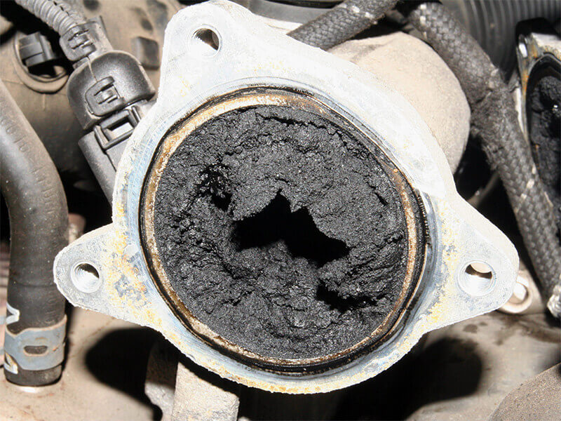

Focus Mindset

## Focus Mindset - Technical

## Generator Load Bank Testing and SFG20 Requirements

### Abstract
Generator reliability in data centres is not a backup convenience; it is a primary risk-control function. Every UPS, battery string, and redundancy design ultimately depends on one practical question: can the standby generator start, accept load, and sustain stable operation during utility failure. This paper outlines the engineering basis of load bank testing, its alignment with SFG20 schedules, and the operational risk of treating low-load run tests as proof of resilience.

### 1. Introduction
Generator load testing in data centres is non-negotiable for continuity assurance. SFG20 treats generator testing as a structured maintenance obligation rather than an optional commissioning activity. The core principle is simple: unproven full-load performance equals unproven resilience.

### 2. Technical Failure Modes in Standby Generators
Data centre generators spend most of their life in standby, creating predictable engineering risk.

- Wet stacking: unburnt fuel and carbon accumulate in the exhaust path during low-load operation, reducing combustion quality and increasing failure risk under demand [1], [3].
- Fuel degradation: diesel oxidises, absorbs moisture, and can support microbial growth when turnover and thermal cycling are inadequate.
- Alternator under-excitation effects: machines that rarely operate at meaningful load may develop insulation moisture, unstable voltage regulation, and degraded dynamic response [2].

These are common RCA findings in Tier II-IV environments after real transfer events.

*Fig. 1. Oxidised diesel fuel sample indicating degradation risk in standby generator systems [9].*

### 3. SFG20 Requirements Beyond “Monthly Start-Up”
SFG20 schedules 07-02, 07-03, and 07-04 define a broader verification regime [5]-[7]:

- Monthly functional test: start and run verification at no or low load.
- Quarterly load test: operation at minimum effective loading (typically >=30% or OEM requirement) to reduce wet stacking risk [1], [3].
- Annual full-load test: sustained operation in the 70-100% rated kW range using building load and/or load bank.
- Fuel integrity checks: sampling, contamination checks, and corrective fuel conditioning.
- Exhaust and thermal checks: confirmation of appropriate operating temperature and combustion behaviour.
- ATS-integrated testing: system-level verification, not isolated genset operation.

*Fig. 2. Wet stacking-related carbon deposits observed in a standby generator exhaust condition [8].*

### 4. Why Data Centres Require Stricter Load Validation
Data centres are electrically unforgiving during transfer events:

- High step-load behaviour from UPS and downstream IT distribution [2].
- Non-linear demand profiles that challenge alternator and AVR stability [3].
- Tight tolerance expectations for voltage and frequency in critical digital loads.
- Minimal tolerance for delayed stabilisation after black-start conditions.

Load testing verifies transient response, governor control quality, AVR stability, cooling margin, and fuel delivery performance under realistic stress.

### 5. Building Load vs. Load Bank Testing
Both methods are valid and complementary.

#### 5.1 Using Building Load
- Pros: realistic end-to-end verification of UPS, ATS, protection, and distribution path.
- Cons: may not achieve required loading; introduces operational risk when redundancy margins are tight.

#### 5.2 Using Load Banks
- Pros: controlled test environment; repeatable path to high and full-load validation; useful for commissioning and annual stress tests [3].
- Cons: does not validate the full downstream electrical chain.

#### 5.3 Recommended Hybrid Strategy
Quarterly load bank validation combined with an annual integrated building-load transfer test provides stronger assurance than either method alone.

### 6. Compliance and Commercial Risk
In outage investigations, insurers, auditors, and clients typically require objective evidence:

- Documented load test records.
- Fuel quality and treatment reports.
- ATS transfer logs.
- Generator performance trend data.
- Demonstrable alignment with SFG20 and OEM guidance.

Deficient evidence can contribute to claim disputes, contractual penalties, certification risk, and reputational damage.

### 7. Practical Test Framework for Data Centres

- Monthly: functional start and run checks (no-load baseline).
- Quarterly: 30-50% loading via load bank or controlled building load.
- Semi-annual: ATS-integrated transfer validation.
- Annual: 70-100% sustained full-load performance test.
- Fuel: quarterly sampling and annual polishing/treatment as required.
- Controls: annual governor and AVR verification/calibration.

---

## References

1. U.S. Department of Energy, “Diesel Generator Wet Stacking: Causes and Prevention,” Office of Energy Efficiency & Renewable Energy, 2020.
2. Caterpillar Inc., “Generator Set Load Acceptance and Transient Response,” Caterpillar Technical Application Guide, 2019.
3. Cummins Power Generation, “Load Bank Performance Testing,” Cummins Technical Bulletin, 2021.
4. FG Wilson, “The Importance of Load Bank Testing for Standby Generators,” FG Wilson Technical Bulletin, 2020.
5. SFG20, “Maintenance Schedule 07-02: Standby Generators,” Building Engineering Services Association (BESA), 2023.
6. SFG20, “Maintenance Schedule 07-03: Generator Control Systems,” Building Engineering Services Association (BESA), 2023.
7. SFG20, “Maintenance Schedule 07-04: Fuel Systems for Standby Generators,” Building Engineering Services Association (BESA), 2023.
8. Atlantic Power Energy, “Wet Stacking in Generators: Causes, Consequences, and Solutions,” [Online]. Available: https://atlanticpowerenergy.com/wet-stacking-in-generators-causes-consequences-and-solutions/. [Accessed: Mar. 5, 2026].
9. WASP PFS, “Beating The Heat: How To Protect Stored Diesel,” Mar. 25, 2025. [Online]. Available: https://wasp-pfs.com/beating-the-heat-how-to-protect-stored-diesel/. [Accessed: Mar. 5, 2026].
